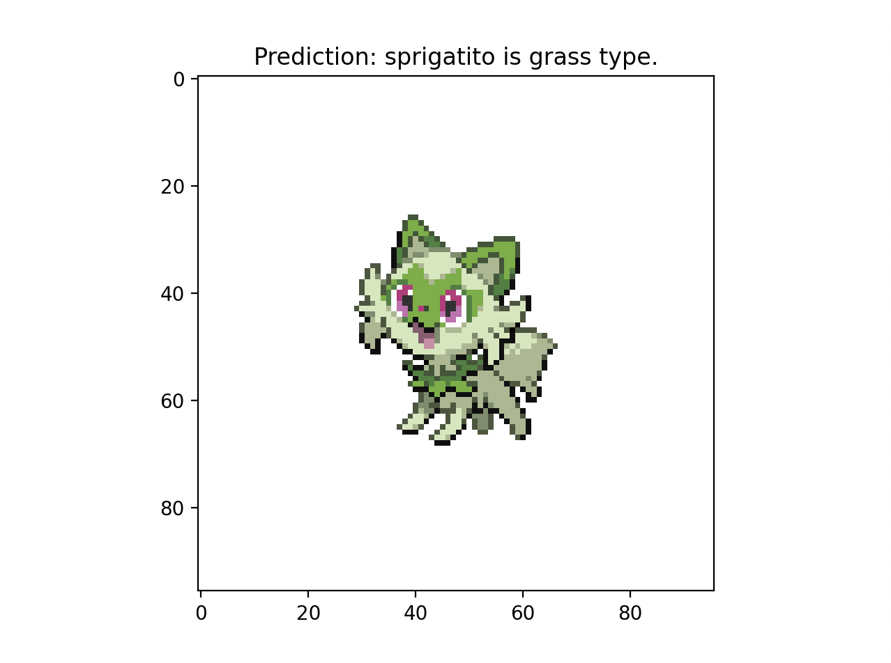
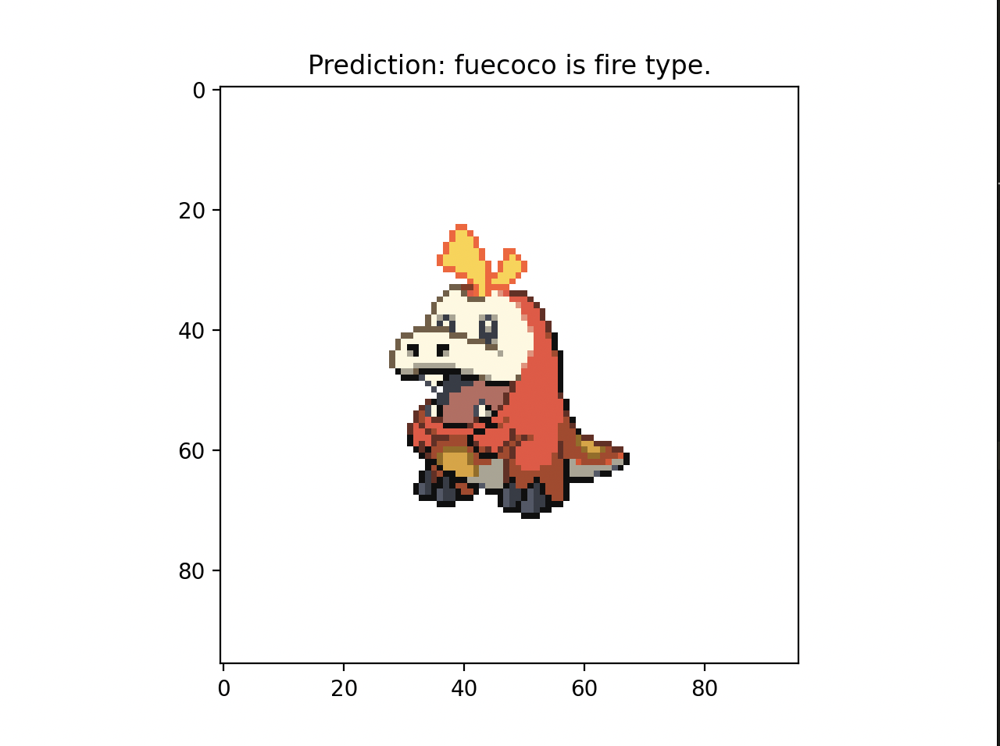
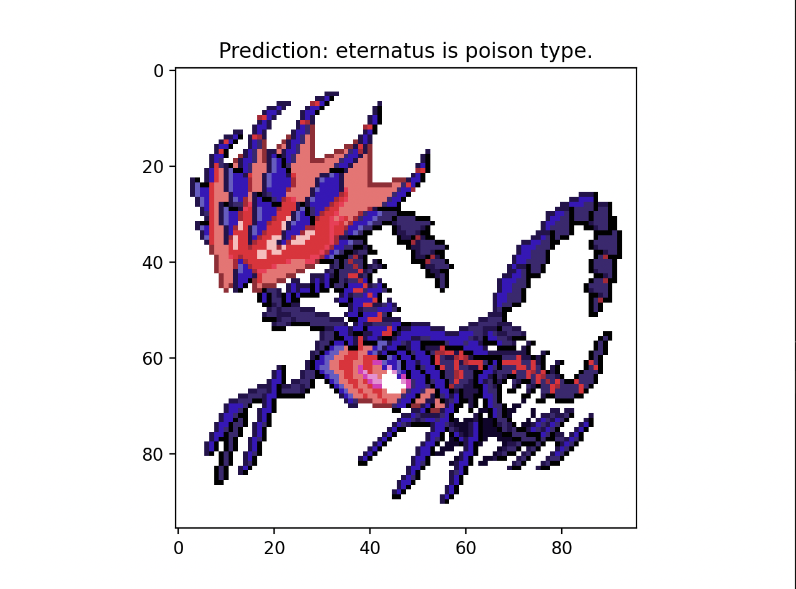
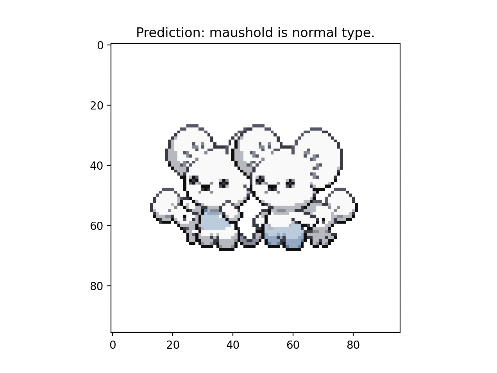
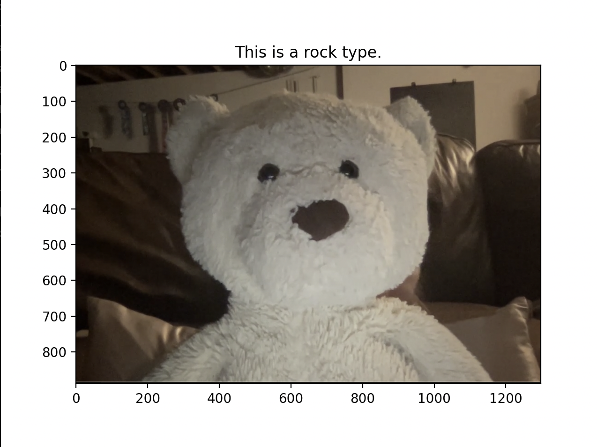

# pokemon_net

#### Have you ever wondered what your pokemon type is? Perhaps you have wondered what your pet's type would be? PokemonNet offers an AI model that can predict the pokemon type of anything given just a picture!

PokemonNet neural network project designed to predict the type of any given Pokemon. This project was undertaken as a practical approach to learning PyTorch and deep learning concepts, with the added fun of using Pokemon as a theme. The project contains an all encapsulating PokemonPredictor that provides an intuitive way to simply download images, train a neural network and test out predictions on pokemon images, or your own images. The maximum accuracy PokemonNet achieved was about 56.6%; random chance is about 5.56%, indicating that the model has really learned to discern pokemon type through image features. Please contact me if you have any questions!

## Project Overview

### Working Example

Below are examples showcasing the Pokemon Net in action:

| Sprigatito | Fuecoco |
| --- | --- |
|  |  |

| Eternatus | Maushold |
| --- | --- |
|  |  |
 
Ever wondered what pokemon type you'd be? You can run the model on a picture of you too! Here's the pokemon type of Bear:
 
 

  

## File Descriptions

- **gather_data.py**: Downloads pokemon images and files from the internet onto your local directory using pokebase, a Python library for the PokeAPI - an API to the entire Pokemon database. This script will load a folder of images and a txt file of types which will be the labels

- **neural_net.py**: Defines the architecture of the neural network (PokemonNet) used for type prediction. It includes two convolutional layers and two fully connected layers.

- **pokemon_dataset.py**: Implements the dataset class (PokemonDataset) used for loading Pokemon images and their corresponding types during training.

- **main.py**: The main script to run the training process. It sets up the dataset, initializes the neural network, and trains the model using PyTorch.

- **type_predictor.py**: A script containing the `PokemonTypePredictor` class. This class facilitates the prediction of Pokemon types based on a trained neural network. It also provides a method to visualize the predictions.

## Getting Started

1. Ensure you have Python installed on your machine.

2. Install the required Python libraries: numpy, torch, torchvision, matplotlib, pokebase

3. Run gather_data.py to download the required images
   
4. Train the neural net in main.py
   
5. Try out some predicitons!
